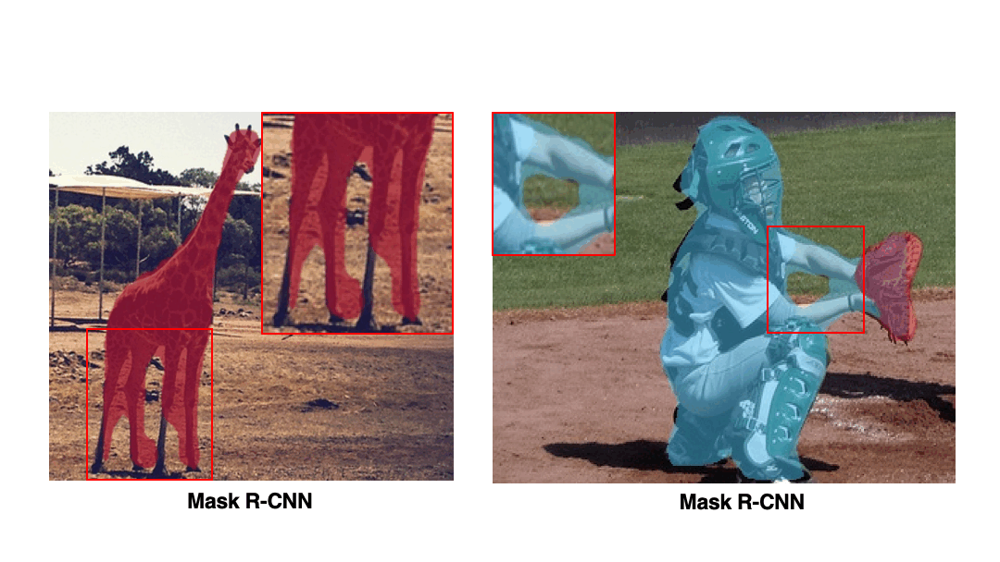
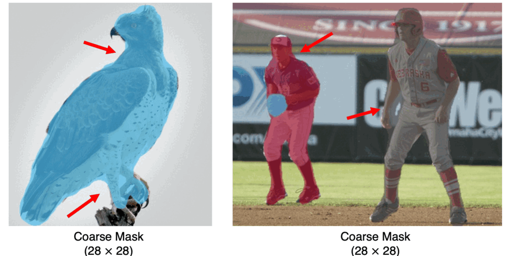
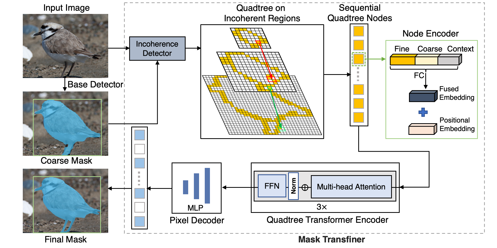

# Mask Transfiner
Mask Transfiner for High-Quality Instance Segmentation [Mask Transfiner, CVPR 2022].

This is the official pytorch implementation of [Transfiner](https://arxiv.org/abs/2111.13673) built on the open-source detectron2. Our project website contains more information, including the visual slider comparison: [vis.xyz/pub/transfiner](https://www.vis.xyz/pub/transfiner/).

> [**Mask Transfiner for High-Quality Instance Segmentation**](https://arxiv.org/abs/2111.13673)           
> Lei Ke, Martin Danelljan, Xia Li, Yu-Wing Tai, Chi-Keung Tang, Fisher Yu  
> CVPR, 2022

Highlights
-----------------
- **Transfiner:** High-quality instance segmentation with state-of-the-art performance and extreme details.
- **Novelty:** An efficient transformer targeting for high-resolution instance masks predictions based on the quadtree structure.
- **Efficacy:** Large mask and boundary AP improvements on three instance segmentation benchmarks, including COCO, Cityscapes and BDD100k. 
- **Simple:** Small additional computation burden compared to standard transformer and easy to use.

<!--  -->
- :fire::fire: **Play with our Mask Transfiner demo** at [](https://huggingface.co/spaces/lkeab/transfiner), supported by [Huggingface Spaces](https://huggingface.co/spaces).



<!-- <table>
    <tr>
          <td><center>

              
Qualitative instance segmentation results of our transfiner, using ResNet-101-FPN and FCOS detector.
          </center></td>
</tr>
</table> -->

## Mask Transfiner with Quadtree Transformer



Results on COCO test-dev
------------
(Check Table 9 of the paper for full results, all methods are trained on COCO train2017. This is a reimplementation. Thus, the numbers might be slightly different from the ones reported in our original paper.)

| Backbone(configs)  | Method | mAP(mask) | 
|----------|--------|-----------|
R50-FPN | Mask R-CNN (ICCV'17) | 34.2 |
R50-FPN | PANet (CVPR'18) | 36.6 |
R50-FPN | MS R-CNN (CVPR'19) | 35.6 |
R50-FPN | PointRend (1x, CVPR'20) | 36.3 |
[R50-FPN](configs/transfiner/mask_rcnn_R_50_FPN_1x.yaml) | Transfiner (1x, CVPR'22)  | 37.0,  [Pretrained Model](https://drive.google.com/file/d/1IHNEs7PLGaw2gftHzMIOAxFzlYVPMc26/view?usp=sharing)|
Res-R50-FPN | [BCNet (CVPR'21)](https://github.com/lkeab/BCNet) | 38.4 | 
[R50-FPN](configs/transfiner/mask_rcnn_R_50_FPN_3x.yaml) | Transfiner (3x, CVPR'22)  | 39.2,  [Pretrained Model](https://drive.google.com/file/d/1EA9pMdUK6Ad9QsjaZz0g5jqbo_JkqtME/view?usp=sharing)|
[**R50-FPN-DCN**](configs/transfiner/mask_rcnn_R_50_FPN_3x_deform.yaml) | **Transfiner (3x, CVPR'22)**  | 40.5, [Pretrained Model](https://drive.google.com/file/d/1N0C_ZhES7iu8qEPG2mrdxf8rWteemxQD/view?usp=sharing) |

| Backbone(configs)  | Method | mAP(mask) |
|----------|--------|-----------|
R101-FPN | Mask R-CNN (ICCV'17) | 36.1 | 
R101-FPN | MS R-CNN (CVPR'19) | 38.3 |
R101-FPN | BMask R-CNN (ECCV'20) | 37.7 | 
R101-FPN | SOLOv2 (NeurIPS'20) | 39.7 | 
R101-FPN |[BCNet (CVPR'21)](https://github.com/lkeab/BCNet) | 39.8|
[R101-FPN](configs/transfiner/mask_rcnn_R_101_FPN_3x.yaml) | Transfiner (3x, CVPR'22) | 40.5, [Pretrained Model](https://drive.google.com/file/d/1Jn27jTpFFWjuX22xvR1upP99nOXfZ1nk/view?usp=sharing) | 
[**R101-FPN-DCN**](configs/transfiner/mask_rcnn_R_101_FPN_3x_deform.yaml) | **Transfiner (3x, CVPR'22)** | **42.2**, [Pretrained Model](https://drive.google.com/file/d/1TpVQksuaXlhioD3WqWppX84MB-l_Eb7-/view?usp=sharing) | 

| Backbone(configs)  | Pretrain | Lr Schd| Size | Method | mAP(box) on Val2017| mAP(mask) on Val2017|
|----------|-----------|--------|-----------|-----------|-----------|-----------|
[Swin-T](configs/transfiner/mask_rcnn_swint_FPN_3x.yaml),[init_weight of imagenet (d2 format)](https://drive.google.com/file/d/1qvNwe4Ax79OqHQnJp5elFuVYsxUiYviJ/view?usp=sharing) | ImageNet-1k | 3X | [480-800] | Transfiner | 46.9| 43.5, [Pretrained Model](https://drive.google.com/file/d/1ezIxmwdMl_cC7gCPEqtLL6zlSYd3R9wA/view?usp=sharing) |
[Swin-B](configs/transfiner/mask_rcnn_swinb_FPN_3x.yaml),[init_weight of imagenet (d2 format)](https://drive.google.com/file/d/12IGYQOa-nlpFhTbgdifbMnSkcke3lmCO/view?usp=sharing) | ImageNet-22k | 3X | [480-800] | Transfiner | 49.8| **45.5**,[Pretrained Model](https://drive.google.com/file/d/1XkEwTMiyADYfvniIrBIDX7RPTSLI4fys/view?usp=sharing) |


Results on LVIS Dataset, v0.5
------------
| Backbone(configs)  | Lr Schd | Method | mAP(mask) | 
|----------|-----------|--------|-----------|
X101-FPN | 1x | Mask R-CNN | 27.1 |
[X101-FPN](configs/LVISv0.5-InstanceSegmentation/mask_rcnn_X_101_32x8d_FPN_1x.yaml) | 1x | Transfiner | 29.2, [Pretrained Model](https://drive.google.com/file/d/1L_bEZf-jJcQqmeCHOf4-c0eOq71cCdis/view?usp=sharing) |


Introduction
-----------------
Two-stage and query-based instance segmentation methods have achieved remarkable results. However, their segmented masks are still very coarse. In this paper, we present Mask Transfiner for high-quality and efficient instance segmentation. Instead of operating on regular dense tensors, our Mask Transfiner decomposes and represents the image regions as a quadtree. Our transformer-based approach only processes detected error-prone tree nodes and self-corrects their errors in parallel. While these sparse pixels only constitute a small proportion of the total number, they are critical to the final mask quality. This allows Mask Transfiner to predict highly accurate instance masks, at a low computational cost. Extensive experiments demonstrate that Mask Transfiner outperforms current instance segmentation methods on three popular benchmarks, significantly improving both two-stage and query-based frameworks by a large margin of +3.0 mask AP on COCO and BDD100K, and +6.6 boundary AP on Cityscapes. 

<!-- <center>
<table>
    <tr>
          <td><center></center></td>
    </tr>
</table>
A brief comparison of mask head architectures, see our paper for full details.
<table>	
    <tr>
          <td><center></center></td>
    </tr>
</table>
</center> -->

## Step-by-step Installation
```
conda create -n transfiner python=3.7 -y
conda activate transfiner
 
conda install pytorch==1.7.1 torchvision==0.8.2 torchaudio==0.7.2 cudatoolkit=11.0 -c pytorch
 
# Coco api and visualization dependencies
pip install ninja yacs cython matplotlib tqdm
pip install opencv-python==4.4.0.40
# Boundary dependency
pip install scikit-image
pip install kornia==0.5.11
 
export INSTALL_DIR=$PWD
 
# install pycocotools. Please make sure you have installed cython.
cd $INSTALL_DIR
git clone https://github.com/cocodataset/cocoapi.git
cd cocoapi/PythonAPI
python setup.py build_ext install
 
# install transfiner
cd $INSTALL_DIR
git clone --recursive https://github.com/SysCV/transfiner.git
cd transfiner/
python3 setup.py build develop
 
unset INSTALL_DIR
```


## Dataset Preparation
Prepare for [coco2017](http://cocodataset.org/#home) dataset and [Cityscapes](https://www.cityscapes-dataset.com) following [this instruction](https://github.com/facebookresearch/detectron2/tree/master/datasets).

```
  mkdir -p datasets/coco
  ln -s /path_to_coco_dataset/annotations datasets/coco/annotations
  ln -s /path_to_coco_dataset/train2017 datasets/coco/train2017
  ln -s /path_to_coco_dataset/test2017 datasets/coco/test2017
  ln -s /path_to_coco_dataset/val2017 datasets/coco/val2017
```

Multi-GPU Training and Evaluation on Validation set
---------------
Refer to our [scripts folder](https://github.com/SysCV/transfiner/tree/main/scripts) for more traning, testing and visualization commands:
 
```
bash scripts/train_transfiner_3x_101.sh
```
Or
```
bash scripts/train_transfiner_1x_50.sh
```

Pretrained Models
---------------
Download the pretrained models from the above [result table](https://github.com/SysCV/transfiner#results-on-coco-test-dev): 
```
  mkdir pretrained_model
  #And put the downloaded pretrained models in this directory.
```

Testing on Test-dev
---------------
```
bash scripts/test_3x_transfiner_101.sh
```

Visualization
---------------
```
bash scripts/visual.sh
```
for swin-based model:
```
bash scripts/visual_swinb.sh
```

Citation
---------------
If you find Mask Transfiner useful in your research or refer to the provided baseline results, please star :star: this repository and consider citing :pencil::
```
@inproceedings{transfiner,
    author={Ke, Lei and Danelljan, Martin and Li, Xia and Tai, Yu-Wing and Tang, Chi-Keung and Yu, Fisher},
    title={Mask Transfiner for High-Quality Instance Segmentation},
    booktitle = {CVPR},
    year = {2022}
}  
```
Related Links
---------------
Related NeurIPS 2021 Work on multiple object tracking & segmentation: [PCAN](https://github.com/SysCV/pcan)

Related CVPR 2021 Work on occlusion-aware instance segmentation: [BCNet](https://github.com/lkeab/BCNet)

Related ECCV 2020 Work on partially supervised instance segmentation: [CPMask](https://www.ecva.net/papers/eccv_2020/papers_ECCV/papers/123530375.pdf)


